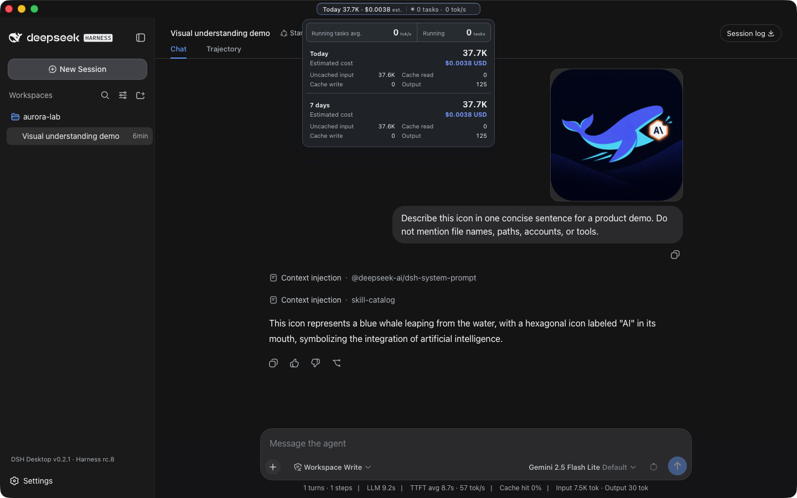

<div align="center">
  
  <h1>DSH Desktop</h1>
  <p><strong>A compact, self-contained desktop host for the official DeepSeek Harness experience.</strong></p>
  <p>
    <a href="https://github.com/chokwinlee/deepseek-harness-desktop/releases/latest">Download</a>
    · <a href="#highlights">Highlights</a>
    · <a href="#development">Development</a>
    · <a href="CONTRIBUTING.md">Contributing</a>
  </p>
  <p>
    <strong>English</strong>
    · <a href="README.zh-CN.md">简体中文</a>
  </p>
  <p>
    <a href="https://github.com/chokwinlee/deepseek-harness-desktop/actions/workflows/ci.yml"></a>
    <a href="https://github.com/chokwinlee/deepseek-harness-desktop/releases/latest"></a>
    <a href="LICENSE"></a>
  </p>
</div>


*macOS downloads under 90 MB, with the complete Harness rc.8 runtime included.*

DSH Desktop runs the official [DeepSeek Harness](https://github.com/deepseek-ai/deepseek-harness) Web UI and runtime in a desktop window. This build is aligned with `@deepseek-ai/dsh@0.1.0-rc.8` and shows that bundled Harness version in the sidebar. The app manages the local Harness process automatically, so users do not need to install Node.js or start `dsh web` themselves.

> [!IMPORTANT]
> This is an independent community project, not an official DeepSeek AI product. DeepSeek Harness is a developer preview and may introduce breaking changes.

## Highlights

- **Multimodal sessions** — paste or attach images and send them through the normal Harness conversation flow when the selected provider and model declare image input support. Image messages remain visible in session history.
- **Usage at a glance on macOS** — see today and seven-day token totals, estimated cost, active task count, and aggregate running throughput without leaving the current session.
- **Compact macOS package** — stays under 90 MB while bundling the complete Harness runtime, using Tauri and the system WKWebView instead of shipping Chromium.
- **Visible runtime alignment** — the sidebar identifies both the Desktop release and its bundled Harness version, such as `DSH Desktop v0.3.0 · Harness rc.8`.
- **Ready to run** — includes everything needed to start Harness, with no separate Node.js installation or terminal command. The app starts and stops the local runtime automatically.

Cost figures are estimates derived from local token logs and available public model prices. Unmatched models stay visibly unpriced rather than being counted as free.

## Multimodal and usage insights



*A real Harness rc.8 image-input session with live token and cost insights, using `google/gemini-2.5-flash-lite` through OpenRouter.*

The compact title-bar summary stays visible while you work. Open it for input, output, cache, cost, and live-throughput details. Usage is calculated locally from Harness session history, with estimated costs based on available public model prices.

## Download

Installers are published on the [latest GitHub Release](https://github.com/chokwinlee/deepseek-harness-desktop/releases/latest).

| Platform | Architecture | File |
| --- | --- | --- |
| macOS | Apple Silicon | `mac-arm64.dmg` |
| macOS | Intel | `mac-x64.dmg` |
| Windows 10/11 | x64 installer | `win-x64.exe` |
| Windows 10/11 | x64 portable | `win-x64.zip` |

Releases also include ZIP archives and `SHA256SUMS.txt` for integrity verification. Download installers from this repository's GitHub Releases page.

## Quick start

1. Install and open DSH Desktop.
2. Open **Settings → Models** and configure a provider and API key.
3. Add or select a workspace.
4. Start a Harness session.
5. Paste or attach an image when the selected model supports image input.

Configuration, workspaces, and sessions live in the same `DSH_HOME` used by the official CLI (`~/.dsh` by default).

## Plugins and recovery

On macOS, open **Settings → Plugins → Install & manage**. The installer accepts an npm package, `github:owner/repo`, a public GitHub HTTPS URL, or a full command such as:

```bash
dsh plugin --profile web add github:owner/repo
```

Desktop parses supported install commands without running pasted text through a shell, then checks that Harness restarts successfully. If startup fails, it restores the previous plugin configuration. Third-party plugins run code on the local machine, so review their source and publisher before installation.

## Architecture

```text
Desktop shell → loopback-only dsh web → official Harness UI/runtime
       └────── shared DSH_HOME for settings, sessions, and plugins
```

The project does not fork or reimplement the Harness agent runtime. The shell owns desktop packaging, process lifecycle, navigation boundaries, recovery, native integration, and release verification.

## Development

Node.js 22.19 or newer is required.

```bash
git clone https://github.com/chokwinlee/deepseek-harness-desktop.git
cd deepseek-harness-desktop
npm ci
npm test
npm start
```

Build the macOS Tauri release with `npm run build:mac`; build the Windows Electron release with `npm run dist`. Packaging changes should also pass the real packaged-runtime checks in [the release workflow](.github/workflows/release.yml).

## Project

- Read [CONTRIBUTING.md](CONTRIBUTING.md) before opening a pull request.
- Report vulnerabilities through the process in [SECURITY.md](SECURITY.md).
- Product and UI decisions follow [PRODUCT.md](PRODUCT.md).
- The desktop host is MIT licensed. Harness and bundled dependencies retain their own licenses; see [THIRD_PARTY_NOTICES.md](THIRD_PARTY_NOTICES.md).
