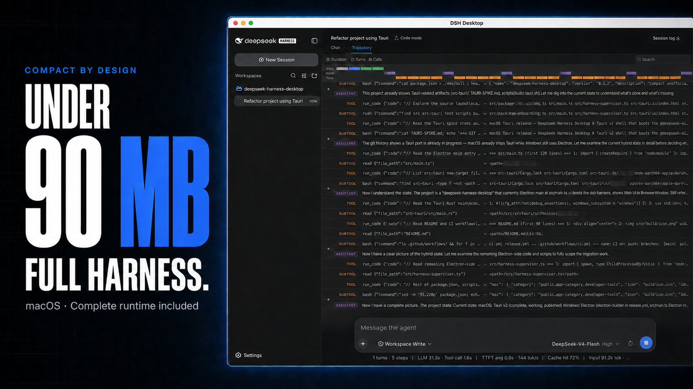

<div align="center">
  
  <h1>DeepSeek Harness Desktop</h1>
  <p><strong>macOS downloads under 90 MB, with the complete Harness runtime included.</strong></p>
  <p>A compact, unofficial desktop host for DeepSeek Harness on macOS and Windows.</p>
  <p>
    <a href="https://github.com/chokwinlee/deepseek-harness-desktop/releases/latest">Download</a>
    · <a href="#installation">Installation</a>
    · <a href="#compact-by-design-on-macos">Why it is compact</a>
    · <a href="CONTRIBUTING.md">Contributing</a>
  </p>
  <p>
    <strong>English</strong>
    · <a href="README.zh-CN.md">简体中文</a>
  </p>
  <p>
    <a href="https://github.com/chokwinlee/deepseek-harness-desktop/actions/workflows/ci.yml"></a>
    <a href="https://github.com/chokwinlee/deepseek-harness-desktop/releases/latest"></a>
    <a href="LICENSE"></a>
  </p>
</div>



DeepSeek Harness Desktop packages the official [DeepSeek Harness](https://github.com/deepseek-ai/deepseek-harness) Web UI and runtime in a native desktop window. It starts and stops Harness automatically, so no separate Node.js installation or terminal command is required.

The macOS build uses Tauri and the system WKWebView instead of shipping another browser engine. The published v0.1.2 DMGs are 86.3 MB for Apple Silicon and 88.8 MB for Intel, about 42% smaller than this project's previous Electron DMGs while retaining the bundled Node sidecar and Harness runtime.

The Harness agent runtime is not forked, modified, or reimplemented here. This repository contains a lightweight Tauri host for macOS, an Electron host for Windows, packaging configuration, runtime verification, and release automation.

The desktop host skips the upstream internal-testing announcement before loading the Web UI. The model API key step remains available because it is functional setup, not a promotional notice.

> [!IMPORTANT]
> This is an independent community project. It is not affiliated with or endorsed by DeepSeek AI. DeepSeek Harness is currently a developer preview and may introduce breaking changes.

## Compact by design on macOS

Download size is one of this project's clearest advantages. Tauri lets the macOS app reuse WKWebView, which is already part of macOS, instead of bundling Chromium. The release build also removes source maps, type declarations, tests, documentation, and native binaries for unused platforms from the packaged runtime.

The result is visible in the published release assets. Sizes below use decimal MB and compare the same architecture and file type across two consecutive releases.

| macOS installer | v0.1.1 Electron | v0.1.2 Tauri | Reduction |
| --- | ---: | ---: | ---: |
| Apple Silicon DMG | 147.8 MB | **86.3 MB** | **41.6%** |
| Intel DMG | 152.6 MB | **88.8 MB** | **41.8%** |

The ZIP downloads are 49.2% smaller on Apple Silicon and 49.3% smaller on Intel. These figures come directly from the published [v0.1.1](https://github.com/chokwinlee/deepseek-harness-desktop/releases/tag/v0.1.1) and [v0.1.2](https://github.com/chokwinlee/deepseek-harness-desktop/releases/tag/v0.1.2) assets.

The smaller download remains self-contained. Users still get the pinned Node sidecar, the official Harness runtime, native PTY and image modules, and automatic process management. CI enforces a 130 MB DMG budget and a 140 MB ZIP budget so future releases cannot silently give back the size reduction.

## Download

Installers are available on the [latest GitHub Release](https://github.com/chokwinlee/deepseek-harness-desktop/releases/latest).

| Platform | Architecture | Recommended file |
| --- | --- | --- |
| macOS | Apple Silicon | `mac-arm64.dmg` |
| macOS | Intel | `mac-x64.dmg` |
| Windows 10/11 | x64 | `win-x64.exe` |
| Windows 10/11 | x64 portable | `win-x64.zip` |

Each release also includes ZIP archives and a `SHA256SUMS.txt` file for integrity verification.

## Installation

### macOS

1. Download the DMG for your Mac.
2. Drag **DeepSeek Harness Desktop** to **Applications** before opening it.
3. Launch the app from Applications.

Tagged macOS releases are hardened and ad-hoc signed by default. When Developer ID and notarization credentials are configured, the same workflow additionally signs, notarizes, and staples the app.

### Windows

Download and run the x64 installer, or extract the portable ZIP. Windows SmartScreen may warn about the current unsigned build; confirm that the file came from this repository before continuing.

## Getting started

1. Open **Settings → Models**.
2. Add your model provider and API key.
3. Add or select a workspace.
4. Start a new Harness session.

The desktop app uses the same `~/.dsh` configuration and session data as the official CLI.

## How it works

```text
DeepSeek Harness Desktop
├── launches the packaged `dsh web` runtime
├── binds it to a random port on 127.0.0.1
├── acknowledges the pinned upstream welcome notice through the Harness API
├── uses Tauri + WKWebView on macOS and Electron on Windows
├── loads only the exact loopback origin in the desktop window
└── terminates the child process when the desktop app exits
```

Navigation is restricted to the local Harness origin and external HTTP(S) or mail links open in the system browser. The macOS Tauri host runs Harness in a dedicated process group so the runtime and its descendants are stopped together.

## Updating

The desktop shell checks GitHub Releases for a newer version a few seconds after startup and shows a small button in the bottom-left corner of the window (like Codex's version widget):

- **No update** – the button reports the current version.
- **Update available** – a green dot appears; clicking it shows the new version, release date, and release notes, with **Download update** (opens the release page in your browser) and **Dismiss this version** (remembers the choice for this version).
- **Check failed** – the panel offers a retry.

The check runs again every 6 hours while the app stays open. This is a community project with ad-hoc signed builds, so updates are downloaded manually from the release page rather than installed in place.

## Development

Node.js 22.19 or newer is required.

```bash
git clone https://github.com/chokwinlee/deepseek-harness-desktop.git
cd deepseek-harness-desktop
npm ci
npm test
npm start
```

Build an unpacked application for the current platform:

```bash
npm run pack
npm run verify:packaged
```

Build a macOS Tauri release for the current architecture with `npm run build:mac`; build the Windows Electron release with `npm run dist`. The application currently pins `@deepseek-ai/dsh@0.1.0-rc.6`; dependency upgrades require a packaged-runtime smoke test and a real desktop launch before release.

Developer ID signing is optional. To enable it, configure these GitHub Actions
secrets: `APPLE_CERTIFICATE` (base64-encoded Developer ID Application `.p12`),
`APPLE_CERTIFICATE_PASSWORD`, `KEYCHAIN_PASSWORD`, `APPLE_ID`, `APPLE_PASSWORD`
(an app-specific password), and `APPLE_TEAM_ID`. Without them, the release uses
ad-hoc signing, matching the earlier unsigned release behavior.

## Release verification

Every tagged release is built on GitHub-hosted macOS Intel, macOS Apple Silicon, and Windows x64 runners. The workflow:

1. installs dependencies from `package-lock.json`;
2. runs the test suite;
3. builds Tauri artifacts on macOS and Electron artifacts on Windows;
4. exercises the packaged native PTY and image modules;
5. starts the packaged runtime, checks its real HTTP UI, and verifies clean shutdown;
6. enforces platform-specific installer size budgets;
7. verifies the macOS code signature, plus notarization when credentials exist; and
8. publishes SHA-256 checksums with the release assets.

## Contributing

Bug reports and focused improvements are welcome. Read [CONTRIBUTING.md](CONTRIBUTING.md) before opening a pull request. For security issues, follow [SECURITY.md](SECURITY.md) instead of opening a public issue.

## License

The desktop host is licensed under the [MIT License](LICENSE). DeepSeek Harness and bundled third-party software retain their respective licenses; see [THIRD_PARTY_NOTICES.md](THIRD_PARTY_NOTICES.md).
