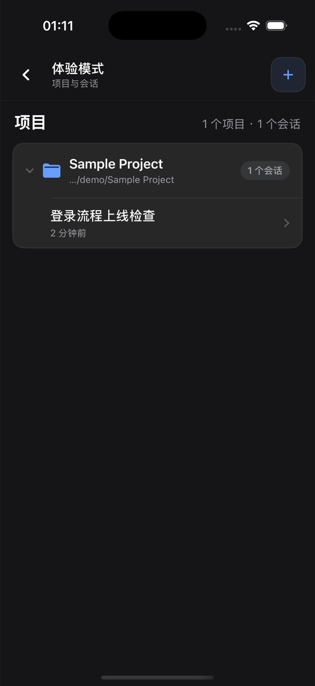

<div align="center">
  
  <h1>DSH Desktop</h1>
  <p><strong>轻量、自包含的 DeepSeek Harness 桌面宿主，以及原生 iPhone Remote。</strong></p>
  <p>
    <a href="https://github.com/chokwinlee/deepseek-harness-desktop/releases/latest">下载</a>
    · <a href="#核心能力">核心能力</a>
    · <a href="#iphone-remote源码预览">iPhone Remote</a>
    · <a href="#开发">开发</a>
    · <a href="CONTRIBUTING.md">参与贡献</a>
  </p>
  <p>
    <a href="README.md">English</a>
    · <strong>简体中文</strong>
  </p>
  <p>
    <a href="https://github.com/chokwinlee/deepseek-harness-desktop/actions/workflows/ci.yml"></a>
    <a href="https://github.com/chokwinlee/deepseek-harness-desktop/releases/latest"></a>
    <a href="LICENSE"></a>
  </p>
</div>


*macOS 下载包低于 90 MB，完整内置 Harness rc.8 运行时。*

DSH Desktop 把官方 [DeepSeek Harness](https://github.com/deepseek-ai/deepseek-harness) Web UI 和运行时放进桌面窗口。本仓库还包含 DSH Remote，一个用于在 iPhone 上继续查看电脑项目、会话和运行任务的原生 SwiftUI 配套 App。当前构建使用 `@deepseek-ai/dsh@0.1.0-rc.8`，侧边栏会同时显示桌面版与内置 Harness 版本。桌面应用会自动管理本机 Harness 进程，用户无需另外安装 Node.js，也不用手动启动 `dsh web`。

> [!IMPORTANT]
> 这是独立社区项目，与 DeepSeek AI 官方产品无关。DeepSeek Harness 仍处于开发者预览阶段，后续版本可能包含不兼容改动。

## 核心能力

- **多模态会话**　所选服务商与模型声明支持图片输入后，可以直接粘贴或附加图片，并沿用 Harness 的标准会话流程。图片消息会保留在会话历史中。
- **macOS 用量统计**　无需离开当前会话，即可查看今日与近七天 Token、估算费用、运行任务数和合计吞吐率。
- **轻巧的 macOS 安装包**　低于 90 MB，完整内置 Harness 运行时；采用 Tauri 并复用系统自带的 WKWebView，无需另外打包 Chromium。
- **内置版本明确**　侧边栏同时标明桌面版与内置 Harness 版本，例如 `DSH Desktop v0.3.0 · Harness rc.8`。
- **开箱即用**　启动 Harness 所需的内容已经完整内置，无需另装 Node.js，也不用执行终端命令。应用会自动启动和关闭本地运行时。
- **原生 iPhone Remote**　可在受信任的同一 Wi-Fi 或用户自己的 Tailscale 网络中配对，随后浏览项目、新建会话、发送或追加指令、停止任务、处理审批与问题、发送图片并跟进子代理；执行始终留在电脑上。

费用来自本地 Token 记录和可用的公开模型价格，只作为估算。无法匹配价格的模型会明确显示为未定价，不会被当作免费。

## 多模态与用量统计


*Harness rc.8 的真实图片输入会话，同时展开 Token 与费用统计，模型通过 OpenRouter 使用 `google/gemini-2.5-flash-lite`。*

标题栏会持续显示精简摘要。展开后可以查看输入、输出、缓存、费用和实时吞吐率。用量根据本地 Harness 会话记录计算，估算费用采用可用的公开模型价格。

## iPhone Remote（源码预览）

> [!NOTE]
> DSH Remote 当前属于 **iOS 源码预览**。目前还没有 App Store 或公开 TestFlight 构建，GitHub Release 也不包含可直接安装的 iOS App。公开 TestFlight 正在准备中。

<p align="center">
  
</p>

DSH Remote 是用户自己拥有或管理的 DSH Desktop 电脑的原生 SwiftUI 配套 App。手机不运行 Agent、仓库、终端或模型服务商；任务仍在电脑执行，iPhone 只提供窄控制面。

- **同一 Wi-Fi（推荐）**　Desktop 在用户明确开启后提供带认证的局域网入口，不需要 Tailscale 账号。
- **离开本地网络**　两台设备加入用户自己的 Tailnet，Desktop 自动配置私有的 Tailscale Serve HTTPS 入口；不要使用 Funnel。
- **没有项目方中继**　代码、提示词、模型凭据、工具执行和会话历史都留在用户电脑。

### TestFlight 开放前如何安装

开发者可以使用 Xcode 把源码预览安装到自己的 iPhone：

1. 在 Mac 安装 Xcode 16 或更高版本，并在 **Xcode → Settings → Accounts** 登录 Apple Account。
2. Clone 本仓库，打开 `ios/DSHRemote/DSHRemote.xcodeproj`。
3. 选择 `DSHRemote` target，在 **Signing & Capabilities** 中选择自己的 Team；如果自动签名提示冲突，请换成自己的唯一 Bundle Identifier。
4. 连接运行 iOS 17 或更高版本的 iPhone，选择该设备，然后执行 **Product → Run**。

免费 Apple Account 可以通过 Xcode Personal Team 在自己的设备上测试，但需要定期重新签名。如果不使用 Xcode，请等待 TestFlight 链接；从 GitHub 下载未签名或与设备不匹配的 IPA 无法直接安装。

### 配对和使用 Remote

1. 安装并打开最新 DSH Desktop。
2. 在 Desktop 打开 **设置 → 通用 → 手机 Remote → 连接 iPhone**。
3. 同一受信任 Wi-Fi 下开启本地配对，并在 DSH Remote 扫描二维码。
4. 使用蜂窝网络或其他外网时，在 Desktop 或 iPhone 打开内置 Tailscale 教程，开启跨网络连接，再扫描 HTTPS 二维码。
5. 进入项目，新建或继续会话；所有执行仍由电脑完成。

进一步阅读：[iOS 源码预览说明](ios/DSHRemote/README.zh-CN.md)、[Tailscale 中文教程](docs/TAILSCALE_REMOTE_SETUP.zh-CN.md)、[隐私政策](docs/PRIVACY.md)、[支持说明](docs/SUPPORT.md)和 [App Review 说明](docs/APP_REVIEW_NOTES.md)。

## 下载

桌面安装包发布在[最新 GitHub Release](https://github.com/chokwinlee/deepseek-harness-desktop/releases/latest)。当前 Release 尚不包含可直接安装的 iOS App。

| 平台 | 架构 | 文件 |
| --- | --- | --- |
| macOS | Apple Silicon | `mac-arm64.dmg` |
| macOS | Intel | `mac-x64.dmg` |
| Windows 10/11 | x64 安装版 | `win-x64.exe` |
| Windows 10/11 | x64 便携版 | `win-x64.zip` |

Release 同时提供 ZIP 和用于完整性校验的 `SHA256SUMS.txt`。请从本仓库的 GitHub Releases 页面下载安装包。

## Desktop 快速开始

1. 安装并打开 DSH Desktop。
2. 进入 **设置 → 模型**，配置模型服务商和 API Key。
3. 添加或选择工作区。
4. 新建 Harness 会话。
5. 所选模型支持图片输入时，粘贴或附加一张图片。

配置、工作区和会话与官方 CLI 使用相同的 `DSH_HOME`，默认位于 `~/.dsh`。

## 插件与恢复

在 macOS 打开 **设置 → 插件 → 安装与管理**。安装器接受 npm 包、`github:owner/repo`、公开 GitHub HTTPS 地址，也可以直接粘贴下面的完整命令。

```bash
dsh plugin --profile web add github:owner/repo
```

桌面端只解析受支持的安装命令，不会通过 shell 执行粘贴的文本，并会确认 Harness 能否正常重启。启动失败时，应用会恢复之前的插件配置。第三方插件会在本机运行代码，安装前请检查来源与发布者。

## 架构

```text
iPhone Remote ── 带认证的同一 Wi-Fi / Tailnet HTTPS ──┐
                                                       ↓
桌面宿主 ─────────────→ 仅回环地址的 dsh web → 官方 Harness UI / 运行时
    └───────────────── 共用 DSH_HOME，保存设置、会话和插件
```

本项目不分叉或重新实现 Harness agent 运行时，只负责桌面打包、进程生命周期、导航边界、故障恢复、原生集成和发行验证。

## 开发

开发环境需要 Node.js 22.19 或更高版本。

```bash
git clone https://github.com/chokwinlee/deepseek-harness-desktop.git
cd deepseek-harness-desktop
npm ci
npm test
npm start
```

运行 `npm run build:mac` 构建 macOS Tauri 发行包，运行 `npm run dist` 构建 Windows Electron 发行包。涉及打包的变更还应通过[发行工作流](.github/workflows/release.yml)中的真实运行时检查。

在 Xcode 中打开 `ios/DSHRemote/DSHRemote.xcodeproj` 即可构建 iOS 源码预览。iOS App 没有第三方 package 依赖，要求 iOS 17 或更高版本。

## 项目

- 提交 Pull Request 前请阅读 [CONTRIBUTING.md](CONTRIBUTING.md)。
- 安全问题请按照 [SECURITY.md](SECURITY.md) 私下报告。
- 产品与界面决策遵循 [PRODUCT.md](PRODUCT.md)。
- 桌面宿主采用 MIT 许可证；Harness 与内置依赖保留各自许可证，详见 [THIRD_PARTY_NOTICES.md](THIRD_PARTY_NOTICES.md)。
