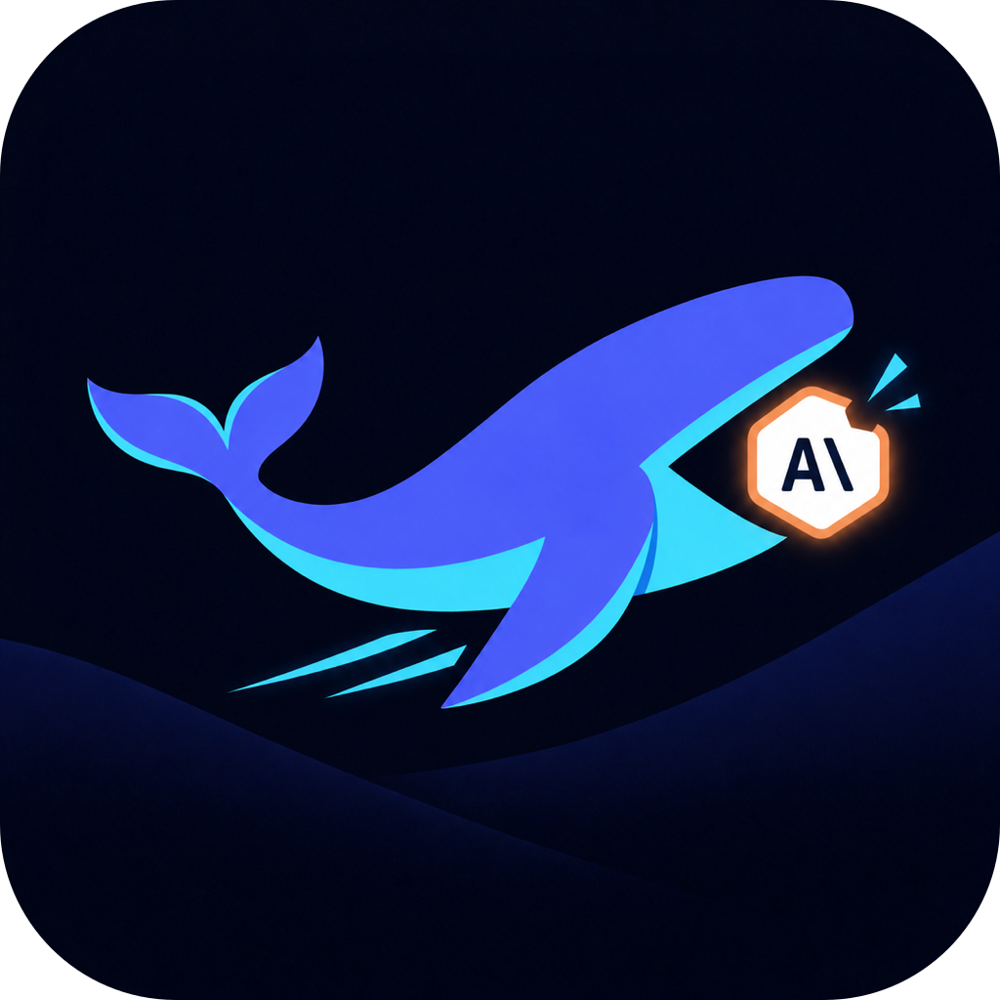
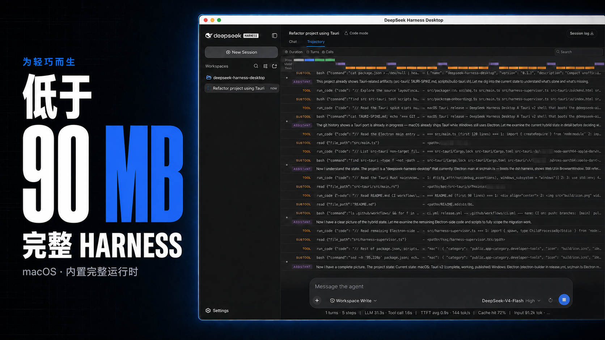
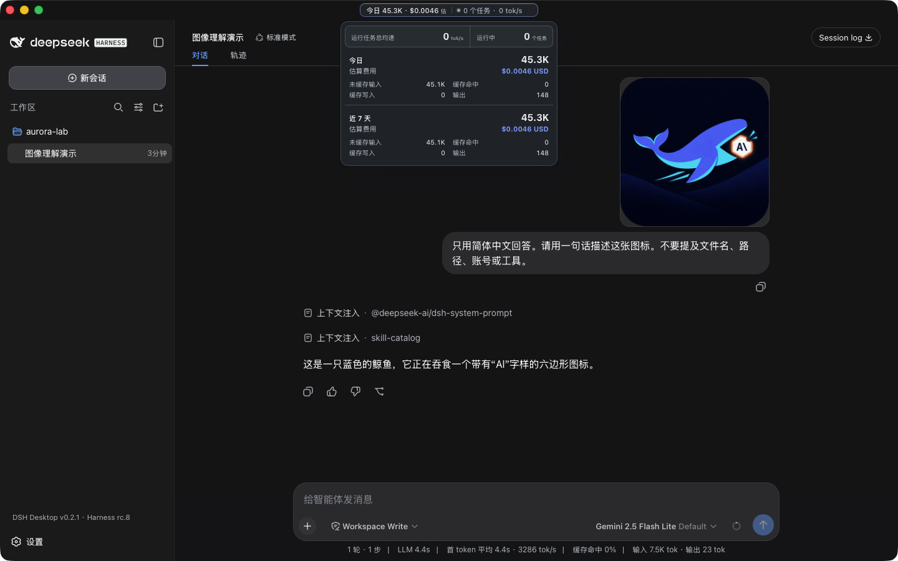
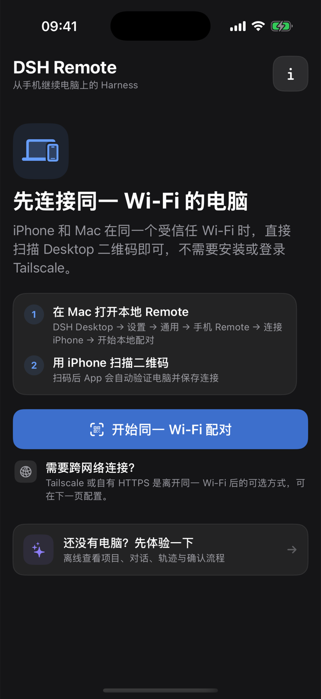
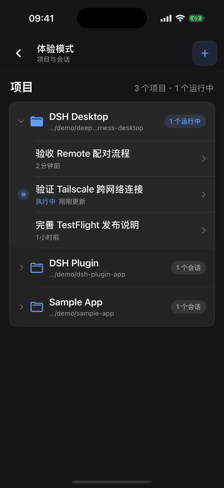
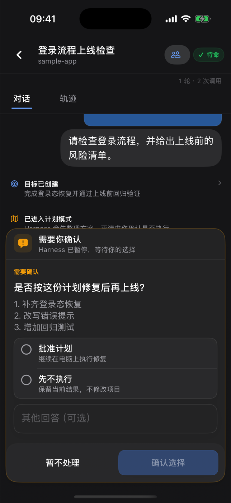

<div align="center">
  
  <h1>DSH Desktop</h1>
  <p><strong>轻量、自包含的 DeepSeek Harness 桌面宿主，以及原生 iPhone 与 Android Remote。</strong></p>
  <p>
    <a href="#下载">下载</a>
    · <a href="#核心能力">核心能力</a>
    · <a href="#iphone-remotetestflight-内测">iPhone Remote</a>
    · <a href="#android-remotegithub-正式版">Android Remote</a>
    · <a href="#开发">开发</a>
    · <a href="CONTRIBUTING.md">参与贡献</a>
  </p>
  <p>
    <a href="README.md">English</a>
    · <strong>简体中文</strong>
  </p>
  <p>
    <a href="https://github.com/chokwinlee/deepseek-harness-desktop/actions/workflows/ci.yml"></a>
    <a href="https://github.com/chokwinlee/deepseek-harness-desktop/releases/latest"></a>
    <a href="LICENSE"></a>
  </p>
</div>



*macOS 下载包低于 90 MB，完整内置 Harness rc.8 运行时。*

DSH Desktop 把官方 [DeepSeek Harness](https://github.com/deepseek-ai/deepseek-harness) Web UI 和运行时放进桌面窗口。本仓库还包含 DSH Remote 原生 iPhone 与 Android 配套 App，用于继续查看电脑项目、会话和运行任务。当前构建使用 `@deepseek-ai/dsh@0.1.0-rc.8`，侧边栏会同时显示桌面版与内置 Harness 版本。桌面应用会自动管理本机 Harness 进程，用户无需另外安装 Node.js，也不用手动启动 `dsh web`。

> [!IMPORTANT]
> 这是独立社区项目，与 DeepSeek AI 官方产品无关。DeepSeek Harness 仍处于开发者预览阶段，后续版本可能包含不兼容改动。

## 核心能力

- **多模态会话**　所选服务商与模型声明支持图片输入后，可以直接粘贴或附加图片，并沿用 Harness 的标准会话流程。图片消息会保留在会话历史中。
- **macOS 用量统计**　无需离开当前会话，即可查看今日与近七天 Token、估算费用、运行任务数和合计吞吐率。
- **轻巧的 macOS 安装包**　低于 90 MB，完整内置 Harness 运行时；采用 Tauri 并复用系统自带的 WKWebView，无需另外打包 Chromium。
- **内置版本明确**　侧边栏同时标明桌面版与内置 Harness 版本，例如 `DSH Desktop v0.4.0 · Harness rc.8`。
- **开箱即用**　启动 Harness 所需的内容已经完整内置，无需另装 Node.js，也不用执行终端命令。应用会自动启动和关闭本地运行时。
- **原生手机 Remote**　SwiftUI iPhone 客户端与 Kotlin/Compose Android 客户端可在受信任的同一 Wi-Fi 或用户自己的 Tailscale 网络中配对，随后浏览项目、新建会话、引导任务、处理审批、发送图片并跟进子代理；执行始终留在电脑上。

费用来自本地 Token 记录和可用的公开模型价格，只作为估算。无法匹配价格的模型会明确显示为未定价，不会被当作免费。

## 多模态与用量统计



*Harness rc.8 的真实图片输入会话，同时展开 Token 与费用统计，模型通过 OpenRouter 使用 `google/gemini-2.5-flash-lite`。*

标题栏会持续显示精简摘要。展开后可以查看输入、输出、缓存、费用和实时吞吐率。用量根据本地 Harness 会话记录计算，估算费用采用可用的公开模型价格。

## iPhone Remote（TestFlight 内测）

> [!IMPORTANT]
> 外部 TestFlight 构建已经通过 Beta App Review。普通用户可以通过[公开 TestFlight 链接](https://testflight.apple.com/join/7Ew6Yk9V)安装。App Store 正式上架仍是后续独立里程碑，GitHub Release 不提供可安装 IPA。

<p align="center">
  
  
  
</p>
<p align="center"><sub>同一 Wi-Fi 配对 · 项目与运行会话 · 审批处理</sub></p>

DSH Remote 是用户自己拥有或管理的 DSH Desktop 电脑的原生 SwiftUI 配套 App。手机不运行 Agent、仓库、终端或模型服务商；任务仍在电脑执行，iPhone 只提供窄控制面。

iOS TestFlight 内测版会跟随设备为 App 选择的语言，目前已完整覆盖英文与简体中文，包括设置、错误、通知、审批、模型、轨迹和子代理流程。

- **同一 Wi-Fi（推荐）**　Desktop 在用户明确开启后提供带认证的局域网入口，不需要 Tailscale 账号。
- **离开本地网络**　两台设备加入用户自己的 Tailnet，Desktop 自动配置私有的 Tailscale Serve HTTPS 入口；不要使用 Funnel。
- **没有项目方中继**　代码、提示词、模型凭据、工具执行和会话历史都留在用户电脑。

### 通过 TestFlight 安装

1. 在运行 iOS 17 或更高版本的 iPhone 安装 Apple 的 [TestFlight App](https://apps.apple.com/app/testflight/id899247664)。
2. 打开 [DSH Remote 公开邀请链接](https://testflight.apple.com/join/7Ew6Yk9V)，选择“在 TestFlight 中查看”，接受邀请并安装。
3. 配对前，在电脑安装当前 DSH Desktop 正式版。

公开组最多接受 10,000 名测试者。每个上传到 TestFlight 的构建最长可测试 90 天。iOS 可安装版本由 TestFlight 提供，不通过 GitHub 分发。

### 使用 Xcode 从源码安装

开发者也可以使用 Xcode 把源码安装到自己的 iPhone：

1. 在 Mac 安装 Xcode 16 或更高版本，并在 **Xcode → Settings → Accounts** 登录 Apple Account。
2. Clone 本仓库，打开 `ios/DSHRemote/DSHRemote.xcodeproj`。
3. 选择 `DSHRemote` target，在 **Signing & Capabilities** 中选择自己的 Team；如果自动签名提示冲突，请换成自己的唯一 Bundle Identifier。
4. 连接运行 iOS 17 或更高版本的 iPhone，选择该设备，然后执行 **Product → Run**。

免费 Apple Account 可以通过 Xcode Personal Team 在自己的设备上测试，但需要定期重新签名。从 GitHub 下载未签名或与设备不匹配的 IPA 无法直接安装。

### 配对和使用 Remote

1. 安装并打开最新 DSH Desktop。
2. 在 Desktop 打开 **设置 → 通用 → 手机 Remote → 连接手机**。
3. 同一受信任 Wi-Fi 下开启本地配对，并在 DSH Remote 扫描二维码。
4. 使用蜂窝网络或其他外网时，在 Desktop 或 iPhone 打开内置 Tailscale 教程，开启跨网络连接，再扫描 HTTPS 二维码。
5. 进入项目，新建或继续会话；所有执行仍由电脑完成。

进一步阅读：[iOS TestFlight 与源码安装说明](ios/DSHRemote/README.zh-CN.md)、[Tailscale 中文教程](docs/TAILSCALE_REMOTE_SETUP.zh-CN.md)、[隐私政策](docs/PRIVACY.md)、[支持说明](docs/SUPPORT.md)和 [App Review 说明](docs/APP_REVIEW_NOTES.md)。

## Android Remote（GitHub 正式版）

> [!IMPORTANT]
> [`v0.4.0`](https://github.com/chokwinlee/deepseek-harness-desktop/releases/tag/v0.4.0) 是首个提供签名 Android APK 的 GitHub 正式版，要求 Android 8.0 或更高版本，并需要同一 Release 中配套的 DSH Desktop。当前尚未通过 Google Play 分发。

<p align="center">
  
  
</p>
<p align="center"><sub>本地优先配对与离线 Demo · 对话、队列和审批控制</sub></p>

Android 与 iOS 复用相同的本地优先 Remote v1 协议、二维码格式、Desktop LAN 代理和 Tailscale HTTPS 流程。当前实现包括加密多电脑存储、项目和会话、完整对话与轨迹、queue/steer、审批与结构化问题、图片与引用、模型、Goal/Plan、多层子代理、本地通知、离线 Demo、英文、简体中文、深色外观和 TalkBack 语义。

安装步骤：

1. 打开 [`v0.4.0` 正式版页面](https://github.com/chokwinlee/deepseek-harness-desktop/releases/tag/v0.4.0)，在电脑安装该页面提供的 Desktop 包。
2. 在 Android 8.0 或更高版本的设备下载 `DSH-Remote-Android-v0.4.0.apk`。系统询问时，可以临时为打开文件的浏览器或文件管理器允许“安装未知应用”。
3. 把 APK 的 SHA-256 与同一 Release 中 `SHA256SUMS.txt` 的对应记录进行比较。
4. 先体验离线 Demo，或在 Desktop 选择 **设置 → 通用 → 手机 Remote → 连接手机** 并扫描二维码。

同一 Wi-Fi 直连带认证但没有加密，只能用于受信任的私有网络。使用蜂窝网络、异地网络或不受信任的 Wi-Fi 时，请改用私有 Tailscale Serve HTTPS，绝对不要使用 Funnel。相机和通知权限均为可选。二维码图像只在设备端处理，但内置的 Google ML Kit 扫描组件会向 Google 发送[隐私政策](docs/PRIVACY.md#android-qr-scanner-and-google-ml-kit)所述的诊断与使用指标。

电脑必须保持在线并运行 Desktop 与 Harness。本地通知只提供尽力提醒，设备差异和已知边界记录在 Android 指南中。完整说明见 [Android 中文安装与支持指南](android/README.zh-CN.md)、[英文指南](android/README.md)、[支持说明](docs/SUPPORT.md)和[平台中立 Remote 协议](docs/REMOTE_PROTOCOL_V1.md)。

## 下载

Desktop 安装包和 Android APK 均位于[最新稳定 GitHub Release](https://github.com/chokwinlee/deepseek-harness-desktop/releases/latest)。iPhone 可安装版本通过[公开 TestFlight 内测](https://testflight.apple.com/join/7Ew6Yk9V)提供。

| 当前稳定版 | 架构 | 文件 |
| --- | --- | --- |
| macOS | Apple Silicon | `DSH-Desktop-0.4.0-mac-arm64.dmg` |
| macOS | Intel | `DSH-Desktop-0.4.0-mac-x64.dmg` |
| Windows 10/11 | x64 安装版 | `DSH-Desktop-0.4.0-win-x64.exe` |
| Windows 10/11 | x64 便携版 | `DSH-Desktop-0.4.0-win-x64.zip` |
| Android 8.0+ | 通用 APK | `DSH-Remote-Android-v0.4.0.apk` |
| iPhone，iOS 17+ | 公开内测 | [TestFlight 邀请链接](https://testflight.apple.com/join/7Ew6Yk9V) |

正式版还提供 macOS ZIP 与用于完整性校验的 `SHA256SUMS.txt`。GitHub 不提供通用 iOS IPA。

## Desktop 快速开始

1. 安装并打开 DSH Desktop。
2. 进入 **设置 → 模型**，配置模型服务商和 API Key。
3. 添加或选择工作区。
4. 新建 Harness 会话。
5. 所选模型支持图片输入时，粘贴或附加一张图片。

配置、工作区和会话与官方 CLI 使用相同的 `DSH_HOME`，默认位于 `~/.dsh`。

## 插件与恢复

在 macOS 打开 **设置 → 插件 → 安装与管理**。安装器接受 npm 包、`github:owner/repo`、公开 GitHub HTTPS 地址，也可以直接粘贴下面的完整命令。

```bash
dsh plugin --profile web add github:owner/repo
```

桌面端只解析受支持的安装命令，不会通过 shell 执行粘贴的文本，并会确认 Harness 能否正常重启。启动失败时，应用会恢复之前的插件配置。第三方插件会在本机运行代码，安装前请检查来源与发布者。

## 架构

```text
iPhone Remote ── 带认证的同一 Wi-Fi / Tailnet HTTPS ──┐
Android Remote ─ 带认证的同一 Wi-Fi / Tailnet HTTPS ──┤
                                                       ↓
桌面宿主 ─────────────→ 仅回环地址的 dsh web → 官方 Harness UI / 运行时
    └───────────────── 共用 DSH_HOME，保存设置、会话和插件
```

本项目不分叉或重新实现 Harness agent 运行时，只负责桌面打包、进程生命周期、导航边界、故障恢复、原生集成和发行验证。

## 开发

开发环境需要 Node.js 22.19 或更高版本。

```bash
git clone https://github.com/chokwinlee/deepseek-harness-desktop.git
cd deepseek-harness-desktop
npm ci
npm test
npm start
```

运行 `npm run build:mac` 构建 macOS Tauri 发行包，运行 `npm run dist` 构建 Windows Electron 发行包。涉及打包的变更还应通过[发行工作流](.github/workflows/release.yml)中的真实运行时检查。

在 Xcode 中打开 `ios/DSHRemote/DSHRemote.xcodeproj` 即可构建 iOS 客户端。iOS App 没有第三方 package 依赖，要求 iOS 17 或更高版本。

使用 JDK 17 与 Android SDK 37 构建 Android 客户端：

```bash
cd android
./gradlew testDebugUnitTest compileDebugAndroidTestKotlin lintDebug validateDebugScreenshotTest assembleDebug assembleRelease bundleRelease
```

## 项目

- 提交 Pull Request 前请阅读 [CONTRIBUTING.md](CONTRIBUTING.md)。
- 安全问题请按照 [SECURITY.md](SECURITY.md) 私下报告。
- 产品与界面决策遵循 [PRODUCT.md](PRODUCT.md)。
- 桌面宿主采用 MIT 许可证；Harness 与内置依赖保留各自许可证，详见 [THIRD_PARTY_NOTICES.md](THIRD_PARTY_NOTICES.md)。
