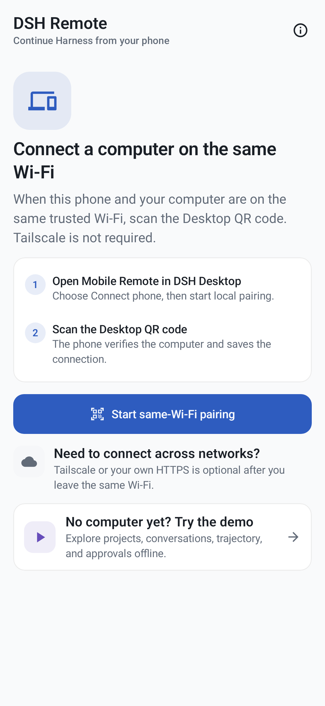
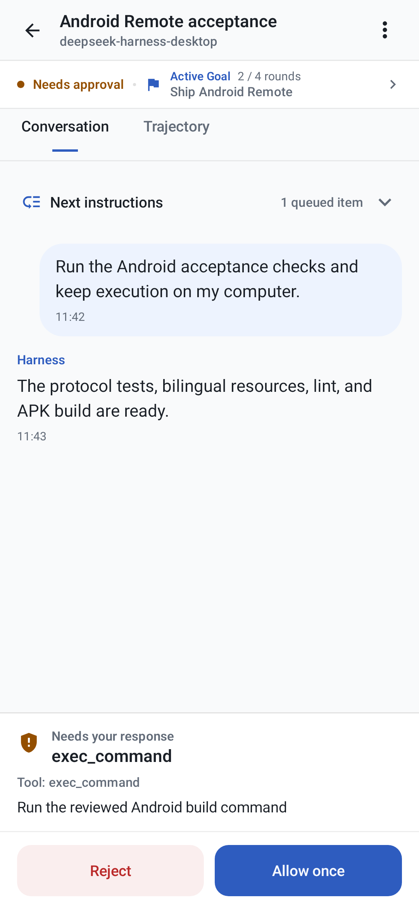

# DSH Remote for Android

[English](./README.md) · [简体中文](./README.zh-CN.md)

DSH Remote is the native Android companion for DSH Desktop. It connects
directly to a Harness computer owned or managed by the user. The project does
not operate its own relay, account service, analytics service, advertising SDK,
push service, or model gateway.

> [!IMPORTANT]
> `v0.4.0-beta.1` is a **GitHub pre-release for testing**, not a Google Play
> release. Install only the APK from this repository. It requires Android 8.0
> or later and the matching latest DSH Desktop build from the same release.

<p align="center">
  
  
</p>
<p align="center"><sub>Pairing and offline Demo · Conversation, queue, and approvals</sub></p>

## Install the GitHub beta

1. Open the [`v0.4.0-beta.1` pre-release](https://github.com/chokwinlee/deepseek-harness-desktop/releases/tag/v0.4.0-beta.1).
2. Install the Desktop package from that release on the computer that will run
   Harness. An older Desktop build may not provide the Android Remote contract
   expected by this beta.
3. On an Android 8.0 or later device, download
   `DSH-Remote-Android-v0.4.0-beta.1.apk` from the same release.
4. If Android asks, allow **Install unknown apps** for the browser or file
   manager that opened this APK. You can turn that source permission off again
   after installation.
5. Open DSH Remote. Choose **Try the demo** to explore it offline, or pair a
   computer by following the next section.

Android may show a generic warning for sideloaded apps. Do not bypass a signature
or checksum mismatch, and do not install an APK copied from another website.

### Verify the download

Download `SHA256SUMS.txt` from the same pre-release. On macOS, compare the APK's
computed hash with its line in that file:

```sh
shasum -a 256 DSH-Remote-Android-v0.4.0-beta.1.apk
grep 'DSH-Remote-Android-v0.4.0-beta.1.apk$' SHA256SUMS.txt
```

On Linux, replace the first command with:

```sh
sha256sum DSH-Remote-Android-v0.4.0-beta.1.apk
```

On Windows PowerShell:

```powershell
Get-FileHash .\DSH-Remote-Android-v0.4.0-beta.1.apk -Algorithm SHA256
Select-String -Path .\SHA256SUMS.txt -Pattern 'DSH-Remote-Android-v0.4.0-beta.1.apk$'
```

The two SHA-256 values must match exactly. The APK is also signed with the
project's permanent certificate; its public fingerprint is recorded in the
[release-signing guide](../docs/ANDROID_RELEASE_SIGNING.md#provisioned-project-identity).

## Pair and use it

### Same trusted Wi-Fi

1. Keep the matching DSH Desktop build running.
2. Open **DSH Desktop → Settings → General → Mobile Remote → Connect phone**.
3. Enable same-Wi-Fi access and scan the Desktop-generated QR code in DSH
   Remote.
4. Open a project and create or continue a session. Agent execution, code,
   repositories, Shell access, and model credentials remain on the computer.

Same-Wi-Fi mode uses an authenticated but unencrypted HTTP connection. Use it
only on a private network you trust, never on hotel, café, school, office guest,
or other shared Wi-Fi. If Desktop regenerates or disables its LAN endpoint,
scan the new QR code instead of reusing an old credential.

### Tailscale away from the local network

1. Install Tailscale on the computer and Android device, then sign in to the
   same private Tailnet.
2. In Desktop's phone connection panel, enable anywhere access. Desktop
   configures a private Tailscale Serve HTTPS address and a new QR code.
3. Scan that HTTPS QR code in DSH Remote. To test the real remote path, turn off
   Wi-Fi and send a message while cellular data and Tailscale remain connected.

Use Tailscale **Serve**, not Funnel. Funnel would expose the endpoint to the
public internet.

## Offline Demo

On the first screen, choose **Try the demo**. The Demo uses sample projects,
sessions, approvals, questions, queue controls, Activity, and subagents. It does
not connect to a computer, use the network, call a model, or modify a real
Harness session. Demo changes are not transferred to a computer later.

## Permissions

- **Camera:** optional; used only after you choose to scan a Desktop pairing QR
  code. QR image pixels and decoded contents are processed on-device and are
  not uploaded. The bundled Google ML Kit scanner does send Google diagnostic
  and usage metrics, as disclosed in the [privacy policy](../docs/PRIVACY.md#android-qr-scanner-and-google-ml-kit).
- **Local network / Nearby devices:** Android 17 asks for this before a direct
  same-Wi-Fi connection. Tailscale HTTPS does not use this direct-LAN permission
  path.
- **Notifications:** optional; enables local, best-effort task updates while
  the app process is observing the computer.
- **Photos:** Android's system Photo Picker grants access only to images you
  explicitly select. DSH Remote does not request broad photo-library access.
- **VPN:** Tailscale may request Android's VPN permission in its own app. DSH
  Remote does not receive your Tailscale credentials.

The one-time **Install unknown apps** setting belongs to the browser or file
manager used for sideloading; it is not a runtime permission requested by DSH
Remote.

## Capabilities

- Pair with Desktop by QR code on an authenticated trusted LAN, or use the
  user's Tailscale HTTPS / self-managed HTTPS endpoint.
- Save multiple computers with the entire host record encrypted by an
  Android Keystore AES-256-GCM key.
- Browse authoritative workspaces and directory-based fallback groups, create
  sessions, and open current or archived conversation history.
- Queue or steer prompts, stop work, edit the queue, answer approvals and
  structured questions, and recover state with polling plus WebSocket events.
- Select models and reasoning effort already configured on the computer.
- Display user, assistant, reasoning, tool, terminal, code, diff, Goal, Plan,
  lifecycle, and Activity records.
- Select or paste and sanitize images with the system Photo Picker or clipboard, apply host limits,
  and display persisted message attachments.
- Insert file, directory, and session references.
- Browse nested subagents, load their history, continue eligible agents, and
  stop running agents.
- Use a complete offline Demo without a computer, network request, or model
  call.
- Follow system light/dark appearance with complete English and Simplified
  Chinese product resources and TalkBack semantics.

Code, repositories, model credentials, model calls, Shell access, and Agent
execution remain on the computer.

## Upgrade a GitHub beta

Download a newer APK only from this repository, verify its SHA-256 value, then
open it and choose **Update**. GitHub APKs use the same application ID and
permanent signing identity, so a newer build can update the existing install
without deleting saved computers. Do not uninstall first if you want to retain
that local pairing data. Android will reject an older version or an APK signed
by another identity.

## Known beta limits

- Android physical-device coverage is still limited. Camera pairing, direct
  LAN behavior, Tailscale across cellular networks, notifications, photo input,
  Android 17 local-network permission, 16 KB page-size devices, and
  manufacturer background restrictions need broader tester coverage.
- The computer must remain powered on with DSH Desktop and Harness running.
- Notifications are local best-effort signals, not remote push. Android Doze,
  process death, or manufacturer restrictions can stop them.
- The authenticated same-Wi-Fi transport is not encrypted. Use Tailscale HTTPS
  on any network you do not fully trust.
- Google Play distribution is not available yet. Play-specific setup and review
  work do not affect installation of this GitHub beta.

## Report beta feedback

Open a [GitHub issue](https://github.com/chokwinlee/deepseek-harness-desktop/issues)
and include:

- DSH Remote version from **About and privacy**;
- Android device manufacturer/model and Android version;
- Desktop operating system, DSH Desktop version, and displayed Harness version;
- connection type: Demo, trusted same Wi-Fi, or Tailscale;
- exact reproduction steps, expected result, actual result, and approximate
  time of the failure;
- the visible error text and a redacted screenshot or short recording;
- whether the same action works in Demo and whether reconnecting or rescanning
  changes the result.

If you can use Android developer tools, a short, redacted `adb logcat` excerpt
around the failure is useful. Never post API keys, QR codes, pairing credentials,
Tailnet names, private IP addresses, confidential prompts, source code, or full
unreviewed logs. See the [support guide](../docs/SUPPORT.md) for connection
checks and a copyable report template.

## Build

Requirements:

- JDK 17
- Android SDK Platform 37
- Android SDK Build Tools 37.0.0

The repository pins Gradle 9.4.1, Android Gradle Plugin 9.2.0, Kotlin 2.3.21,
and the Compose BOM 2026.08.00.

```sh
cd android
./gradlew testDebugUnitTest compileDebugAndroidTestKotlin lintDebug validateDebugScreenshotTest assembleDebug assembleRelease bundleRelease
```

The debug APK is written to:

```text
android/app/build/outputs/apk/debug/app-debug.apk
```

Without signing variables, local Release builds remain unsigned. With the
project distribution key configured, the installable APK is written to
`android/app/build/outputs/apk/release/app-release.apk` and the Play bundle to
`android/app/build/outputs/bundle/release/app-release.aab`.

Install it on a connected development device with:

```sh
cd android
./gradlew installDebug
```

The debug APK is development-signed. GitHub tag builds require the persistent
project distribution key and publish only the installable APK; the AAB remains
an Actions artifact. A Google Play release additionally requires a Play Console
app record, store metadata, Data Safety answers, testing track, and review. See
[`docs/ANDROID_RELEASE_SIGNING.md`](../docs/ANDROID_RELEASE_SIGNING.md).

## Security boundary

- `host.describe` verifies the endpoint is Harness.
- Public or manually entered addresses require HTTPS.
- Cleartext HTTP is accepted only for a private/local address imported from a
  Desktop-generated QR code with a valid bearer credential.
- Android 17 requests `ACCESS_LOCAL_NETWORK` at runtime before opening a direct
  LAN socket. Tailscale HTTPS does not use this direct-LAN permission path.
- The LAN proxy exposes only the reviewed mobile RPC allowlist and
  `/api/events.mux`; it does not expose settings, credentials, arbitrary
  directories, plugins, or a raw terminal.
- Saved computer names, addresses, and access credentials are encrypted as one
  authenticated payload. System backup and device transfer exclude app data.
- Selected photos are bounded, decoded, re-oriented, resized, and re-encoded
  before transfer so source metadata is not forwarded.
- Camera frames and decoded QR contents are processed in memory by the bundled
  ML Kit model and are not saved or uploaded. ML Kit separately sends Google
  diagnostic and usage metrics described in the privacy policy.

The platform-neutral contract is documented in
[`docs/REMOTE_PROTOCOL_V1.md`](../docs/REMOTE_PROTOCOL_V1.md).
Future Play submission notes are in
[`docs/ANDROID_DATA_SAFETY.md`](../docs/ANDROID_DATA_SAFETY.md).

## Validation boundary

Gradle unit tests, lint, Compose reference screenshot validation,
debug/release assembly, and Compose instrumentation test compilation are
automated. Camera, trusted-LAN, Tailscale, notification,
photo, and manufacturer-specific background behavior still require Android
physical-device acceptance before a public store release.
