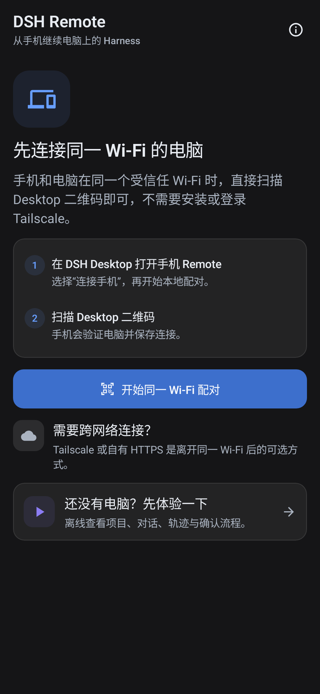
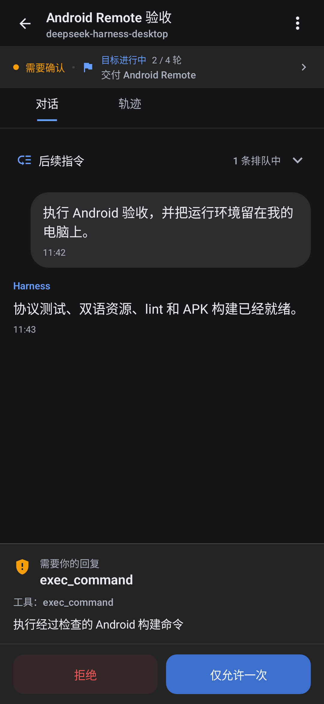

# DSH Remote Android 版

[English](./README.md) · [简体中文](./README.zh-CN.md)

DSH Remote 是 DSH Desktop 的原生 Android 控制端，直接连接用户自己拥有或管理的 Harness 电脑。项目方不运营自己的 relay、账号、分析、广告、推送或模型网关。

> [!IMPORTANT]
> `v0.4.0` 是首个包含签名 Android APK 的 **GitHub 正式版**，当前尚未通过 Google Play 分发。请只安装本仓库提供的 APK。App 要求 Android 8.0 或更高版本，并需要配套的 DSH Desktop。

<p align="center">
  
  
</p>
<p align="center"><sub>配对与离线 Demo · 对话、队列和审批</sub></p>

## 安装 GitHub 正式版

1. 打开 [`v0.4.1` 正式版页面](https://github.com/chokwinlee/deepseek-harness-desktop/releases/tag/v0.4.1)。
2. 在运行 Harness 的电脑上安装该 Release 中的 Desktop 安装包。旧版 Desktop 可能不包含当前 Android Remote 所需的协议。
3. 在 Android 8.0 或更高版本的设备上，从同一页面下载 `DSH-Remote-Android-v0.4.1.apk`。
4. 如果 Android 提示，请为打开 APK 的浏览器或文件管理器允许“安装未知应用”。安装结束后可以重新关闭这个来源权限。
5. 打开 DSH Remote。可以先选择“还没有电脑？先体验一下”进入离线 Demo，也可以按照下一节配对电脑。

Android 可能会对侧载 App 显示通用安全提醒。签名或校验值不一致时不要继续，也不要安装其他网站转载的 APK。

### 校验下载文件

从同一个正式版页面下载 `SHA256SUMS.txt`。在 macOS 中，分别查看 APK 实际哈希与清单记录：

```sh
shasum -a 256 DSH-Remote-Android-v0.4.1.apk
grep 'DSH-Remote-Android-v0.4.1.apk$' SHA256SUMS.txt
```

Linux 把第一条命令换成：

```sh
sha256sum DSH-Remote-Android-v0.4.1.apk
```

在 Windows PowerShell 中：

```powershell
Get-FileHash .\DSH-Remote-Android-v0.4.1.apk -Algorithm SHA256
Select-String -Path .\SHA256SUMS.txt -Pattern 'DSH-Remote-Android-v0.4.1.apk$'
```

两处 SHA-256 必须完全相同。APK 还使用项目永久证书签名，公开证书指纹记录在 [Android 发布签名说明](../docs/ANDROID_RELEASE_SIGNING.md#provisioned-project-identity)中。

## 配对与使用

### 同一受信任 Wi-Fi

1. 保持同一个 Release 中的 DSH Desktop 正在运行。
2. 打开 **DSH Desktop → 设置 → 通用 → 手机 Remote → 连接手机**。
3. 开启同一 Wi-Fi 访问，并在 DSH Remote 扫描 Desktop 生成的二维码。
4. 打开项目，新建或继续会话。Agent 执行、代码、仓库、Shell 和模型凭证始终留在电脑上。

同一 Wi-Fi 模式采用带认证但未加密的 HTTP 连接，只能用于自己信任的私有网络。不要在酒店、咖啡店、学校、办公室访客网络或其他共享 Wi-Fi 中使用。如果 Desktop 重新生成或关闭了局域网入口，请重新扫描新二维码，不要继续复用旧凭据。

### 离开本地网络后使用 Tailscale

1. 在电脑和 Android 设备安装 Tailscale，并登录同一个私有 Tailnet。
2. 在 Desktop 的手机连接面板开启跨网络连接。Desktop 会配置仅 Tailnet 可访问的 Tailscale Serve HTTPS 地址并生成新二维码。
3. 在 DSH Remote 扫描该 HTTPS 二维码。需要验证真实外网路径时，关闭 Wi-Fi，只保留蜂窝网络与 Tailscale，然后打开会话并发送一条消息。

请使用 Tailscale **Serve**，不要使用 Funnel。Funnel 会把入口暴露到公网。

## 离线 Demo

在首屏选择“还没有电脑？先体验一下”。Demo 提供示例项目、会话、审批、问题、队列控制、轨迹和子代理，不连接电脑、不访问网络、不调用模型，也不会修改真实 Harness 会话。Demo 中的操作以后不会同步到电脑。

## 权限说明

- **相机**　可选；仅在用户选择扫描 Desktop 配对二维码后使用。二维码图像和解码结果只在设备端处理，不会上传。内置的 Google ML Kit 扫描组件会向 Google 发送诊断与使用指标，详见[隐私政策](../docs/PRIVACY.md#android-qr-scanner-and-google-ml-kit)。
- **本地网络或附近的设备**　Android 17 会在直连同一 Wi-Fi 前请求此权限。Tailscale HTTPS 不走这个直连局域网权限路径。
- **通知**　可选；允许 App 在进程仍观察电脑任务时显示本地、尽力而为的状态提醒。
- **照片**　系统照片选择器只授予用户明确选择的图片，不需要访问整个照片库。
- **VPN**　Tailscale 可能在自己的 App 中请求 Android VPN 权限。DSH Remote 不会获得用户的 Tailscale 凭据。

侧载时的一次性“安装未知应用”属于浏览器或文件管理器权限，不是 DSH Remote 请求的运行时权限。

## 当前能力

- 扫描 Desktop 二维码，在带认证的受信任局域网中配对，或使用用户自己的 Tailscale HTTPS / 自管 HTTPS。
- 保存多台电脑，并使用 Android Keystore AES-256-GCM 加密整份电脑记录。
- 浏览权威 workspace 与目录回退分组、新建会话、读取当前和归档对话历史。
- 发送、排队或 steer 指令，停止任务，编辑队列，处理审批和结构化问题；轮询与 WebSocket 共同恢复状态。
- 选择电脑已经配置的模型与 reasoning effort。
- 展示用户、助手、推理、工具、终端、代码、diff、Goal、Plan、生命周期与轨迹。
- 通过系统照片选择器或剪贴板添加图片，清理元数据并按 Host 限制预检，同时显示会话持久图片附件。
- 插入文件、目录和已有会话引用。
- 浏览多层子代理、读取历史、继续可恢复子代理并停止运行。
- 无电脑、无网络、无模型调用的完整离线 Demo。
- 跟随系统明暗外观，完整提供英文、简体中文资源和 TalkBack 语义。

代码、仓库、模型凭证、模型调用、Shell 与 Agent 执行始终留在电脑上。

## 升级 GitHub 正式版

只从本仓库下载更高版本 APK，校验 SHA-256 后直接打开并选择“更新”。GitHub APK 使用相同 application ID 和永久签名身份，因此新版可以覆盖升级现有安装，并保留已经保存的电脑。希望保留本地配对数据时不要先卸载。Android 会拒绝安装更低版本或其他签名身份的 APK。

## 已知边界

- Android 真机覆盖仍有限，相机配对、局域网直连、蜂窝网络下的 Tailscale、通知、图片输入、Android 17 本地网络权限、16 KB page size 设备与厂商后台限制仍需更多测试者验证。
- 电脑必须保持开机，并持续运行 DSH Desktop 与 Harness。
- 通知只是本地尽力提醒，不是远程推送。Android Doze、进程被杀或厂商后台限制都可能中断提醒。
- 带认证的同一 Wi-Fi 传输没有加密；任何不能完全信任的网络都应改用 Tailscale HTTPS。
- 当前尚未通过 Google Play 分发。Play 专属配置与审核工作不影响签名 GitHub 正式版的安装。

## 提交反馈

请创建 [GitHub Issue](https://github.com/chokwinlee/deepseek-harness-desktop/issues)，并提供：

- “关于与隐私”页面显示的 DSH Remote 版本；
- Android 设备厂商、型号和 Android 版本；
- Desktop 操作系统、DSH Desktop 版本和界面显示的 Harness 版本；
- 连接类型，包括 Demo、同一受信任 Wi-Fi 或 Tailscale；
- 可重复的具体步骤、预期结果、实际结果与故障大致发生时间；
- 可见错误文字，以及已经遮盖敏感信息的截图或短录屏；
- 同一操作能否在 Demo 中复现，重新连接或重新扫码后是否变化。

如果能够使用 Android 开发工具，可以附上故障时间附近的一小段、已经脱敏的 `adb logcat`。不要发布 API Key、二维码、配对凭据、Tailnet 名称、私有 IP、机密提示词、源码或未经检查的完整日志。连接自检步骤和可复制的反馈模板见[支持说明](../docs/SUPPORT.md)。

## 构建

需要：

- JDK 17
- Android SDK Platform 37
- Android SDK Build Tools 37.0.0

仓库固定使用 Gradle 9.4.1、Android Gradle Plugin 9.2.0、Kotlin 2.3.21 和 Compose BOM 2026.08.00。

```sh
cd android
./gradlew testDebugUnitTest compileDebugAndroidTestKotlin lintDebug validateDebugScreenshotTest assembleDebug assembleRelease bundleRelease
```

Debug APK 输出到：

```text
android/app/build/outputs/apk/debug/app-debug.apk
```

本地未设置签名变量时，Release 构建保持未签名。配置项目长期分发密钥后，
可安装 APK 输出到 `android/app/build/outputs/apk/release/app-release.apk`，
Play AAB 输出到 `android/app/build/outputs/bundle/release/app-release.aab`。

连接开发设备后可以执行：

```sh
cd android
./gradlew installDebug
```

Debug APK 使用开发签名。GitHub 标签构建必须使用项目长期分发密钥，只把可安装 APK 发布给普通用户；AAB 保留在 Actions。发布 Google Play 还需要 Play Console 应用记录、商店资料、Data Safety、测试轨道与审核。详见 [`docs/ANDROID_RELEASE_SIGNING.md`](../docs/ANDROID_RELEASE_SIGNING.md)。

## 安全边界

- 使用 `host.describe` 权威验证目标确实是 Harness。
- 公网和手动地址必须是 HTTPS。
- 只有 Desktop 二维码导入、位于私网/本地地址且带有效 bearer 凭据时，才接受明文 HTTP。
- Android 17 在打开直连局域网 socket 前会请求 `ACCESS_LOCAL_NETWORK` 运行时权限；Tailscale HTTPS 不走这个直连局域网权限路径。
- LAN 代理只开放经过审查的手机 RPC allowlist 与 `/api/events.mux`，不开放设置、凭证、任意目录、插件或原始终端。
- 电脑名称、地址和访问凭据作为一个认证密文保存，系统备份与设备迁移不会带走 App 数据。
- 图片会先做字节和像素限制、采样解码、方向校正、缩放和重新编码，不转发源文件元数据。
- 相机画面与二维码解码内容由 App 内置 ML Kit 模型在内存处理，不保存、不上传。ML Kit 会另外向 Google 发送隐私政策所述的诊断与使用指标。

平台中立协议见 [`docs/REMOTE_PROTOCOL_V1.md`](../docs/REMOTE_PROTOCOL_V1.md)。
未来 Play 提交前的 Data Safety 核对见 [`docs/ANDROID_DATA_SAFETY.md`](../docs/ANDROID_DATA_SAFETY.md)。

## 验收边界

Gradle 单元测试、lint、Compose 参考截图验证、Debug/Release 构建和 Compose instrumentation 测试编译已自动化。相机、受信任局域网、Tailscale、通知、图片以及厂商后台行为仍需 Android 真机验收后，才能进入公开商店发布。
