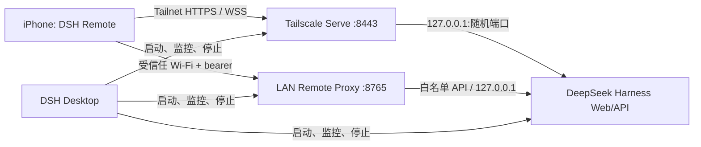

# DSH Desktop iOS Remote 方案

## 决策

产品采用“本地直连 + 用户自带 Tailscale”的私有网络方案，不建设项目方云端中继：



项目方不接触代码、API Key、模型请求、Shell 输出或会话记录，也不承担长连接服务器成本。电脑仍是唯一执行主机；iPhone 只是控制面。

## 当前实现状态

macOS Tauri Remote Host 与原生 iOS SwiftUI 客户端已经实现。Tailscale HTTPS 路径完成真实 Harness、WebSocket、DeepSeek 模型调用与模拟器展示闭环。局域网路径实现独立开关、随机 256-bit 配对凭据、固定 API 白名单代理、二维码导入及 iOS HTTP/WebSocket 认证，并完成代理协议联调。基于本机 DSH Desktop v0.3.0 / Harness rc.8 的专用会话还完成了 DeepSeek 文本与引用、视觉模型图片、持久附件回读、多级子代理浏览，以及 continuable 子代理的历史/补充/停止真实闭环。物理 iPhone 的局域网权限弹窗、蜂窝网络和 Windows Host 仍需发布前验收。

## 为什么 iOS 使用原生 Remote UI

手机端不复制 Desktop 网页，也不承载 Agent runtime。SwiftUI 只实现项目/会话、对话、工具摘要、图片提示词、文件/会话引用、子代理跟进、Prompt、Steer、Cancel、审批和用户问题等窄控制面；执行、代码访问和模型凭据仍全部留在电脑。这样能针对单手操作和小屏适配，同时避免把插件安装、终端、任意目录访问等桌面能力带入 App Store binary。

## Desktop 端需要增加的 Remote Host

### 开启流程

1. Remote 默认关闭。用户在 Desktop 设置中主动点击“开启 Remote”。
2. Desktop 查找 `tailscale` CLI，并读取 `tailscale status --json`。
3. 只有 `BackendState=Running` 且存在本机 `DNSName` 时继续；否则显示安装或登录指引。
4. 选用专用端口 `8443`，构造公开给 Tailnet 的 authority：`<DNSName>:8443`。
5. 受监督地重启 Harness，并在既有参数后追加：

   ```text
   web --host 127.0.0.1 --port 0 --trusted-host <DNSName>:8443
   ```

6. Harness 输出 readiness URL 后，Desktop 启动并持有一个前台 Serve 子进程：

   ```text
   tailscale serve --yes --https=8443 http://127.0.0.1:<随机端口>
   ```

7. 校验 `tailscale serve status --json` 的 `8443` 目标确实等于本次 Harness 端口。
8. Desktop 显示连接地址与二维码：

   ```text
   harnessremote://connect?url=https%3A%2F%2F<DNSName>%3A8443%2F
   ```

### 关闭与异常恢复

- 用户关闭 Remote：先停止 Serve 子进程，再以不带 `--trusted-host` 的默认参数重启 Harness。
- Desktop 正常退出：停止 Serve 子进程，再停止 Harness。
- Harness 重启或随机端口改变：停止旧 Serve，等待新 readiness，再将 Serve 指向新端口。
- Desktop 崩溃：前台 Serve 子进程应随父进程/Job Object/进程组退出；即使 Tailscale 状态短暂残留，旧目标也只是一个已关闭的 loopback 端口。
- 不调用 `tailscale serve reset`，因为它会删除用户机器上的其他 Serve 配置。
- 若 `8443` 已被用户占用，Remote 必须报告冲突，不应覆盖现有配置。首版不自动换端口，避免二维码和 `--trusted-host` 状态漂移。

macOS Tauri 和 Windows Electron 必须共用同一状态机与错误码；平台层只负责可执行文件发现、子进程监督和设置 UI 桥接。

## 安全模型

### 必须保持

- Harness 始终绑定 `127.0.0.1`，不能改为 `0.0.0.0`。
- 跨网络只能使用 Tailscale Serve 或用户自己管理的 HTTPS，不能使用 Funnel。
- `--trusted-host` 只加入当前 Tailnet 的精确 DNS authority 和端口，不能加入通配符。
- Tailscale 二维码只包含 URL；局域网二维码包含 Desktop 每次开启时重新生成的 256-bit bearer 凭据，但不包含 API Key 或 Tailscale key。
- Remote 默认关闭，并提供明确的离线/撤销入口。

### 两层边界

`--trusted-host` 是 DSH 的 Host/Origin 防护，用来允许反向代理后的 HTTPS authority；它不是登录系统。用户身份与设备准入由 Tailscale Tailnet 和 ACL 决定。Tailscale Serve 会向后端添加身份头，但当前 Harness 不消费这些头，所以首版的授权粒度等于“Tailnet 中被允许访问该电脑 8443 端口的成员”。

个人 Tailnet 默认可能允许自己的设备互相访问；若 Tailnet 包含其他成员，应在文档中给出 ACL 示例，把 8443 只开放给用户自己的 iPhone 或用户组。

### 局域网直连边界

- Harness 本身仍只绑定 `127.0.0.1`；Desktop 另启 `:8765` 代理，不能把 Harness 直接绑定到 `0.0.0.0`。
- 代理只接受 `host.describe`、只读 `workspace.list`、会话读写、持久图片附件读取、文件/会话引用候选、子代理列表/历史/补充/停止、会话模型读取/选择、取消、交互响应和事件 WebSocket；其他路径一律 404。任何 `workspace.*` 写操作以及 `llm.*`、`settings.*`、`credentials.*` 配置面仍不对局域网入口开放。
- `session.prompt` 图片仍是 JSON 中的 base64 内容，不是独立上传端点。代理使用背压流式转发、`Content-Length` 预检和累计字节双限，线格式上限为 136 MiB；超限返回 413。
- HTTP 与 WebSocket 都要求二维码中的 bearer，转发到 Harness 前会剥离认证头并重写 loopback Host。
- 裸局域网 HTTP 地址不能在 iOS 手输；缺少凭据时客户端拒绝保存。
- 该路径有认证但没有链路加密，只允许用户明确启用并用于受信任家庭/办公 Wi-Fi；不受信任网络使用 Tailscale HTTPS。

## iOS 客户端范围

当前工程位于 [`ios/DSHRemote`](../ios/DSHRemote)：

- SwiftUI：配对、电脑列表、错误与恢复；
- VisionKit：扫码；
- URLSession：原生 Harness HTTP RPC 与 WebSocket；
- Release 接受任意有效 HTTPS；局域网 HTTP 仅接受私有地址和有效配对凭据；
- App 不包含 `WKWebView`、原始终端或模型凭据编辑。

暂不包含：远程推送服务、后台常驻连接、多用户共享、任意文件上传、原始终端、自动审批危险操作、App Store 订阅。

## 已实现的原生会话控制面

当前客户端使用以下最小协议：

1. `session.list` 与 `session.history`；会话摘要保留上游原始 `cwd`，并兼容 macOS/Linux `/` 和 Windows `\\` 路径提取项目名；
2. 只读 `workspace.list` 作为增强信息，提供电脑端的项目标题、路径、会话顺序和归档集合；接口缺失或请求失败时，会话列表仍按 `session.list` 与 `cwd` 正常展示；
3. `session.models` 与 `session.selectModel`，读取并切换当前会话的 provider、model 与可选 reasoning effort；选中值用于下一次提示词组装，Host 同时 best-effort 把它保存为部署默认值。模型目录在进入会话和每次打开选择器时刷新，整目录失败保留上一次可用状态；
4. `session.prompt`，支持 `queue` 和 `steer`；
5. `session.updateQueue` 与 `session.cancel`；
6. `/api/events.mux` WebSocket 重连；
7. approval/question 的 `/api/respond`；
8. 只读工具视图与 diff。
9. `session.attachment` 按需读取会话中的持久图片；图片引用留在消息模型，二进制数据由 session 级缓存去重，不随轮询重复下载；
10. 从 history events 与 projections 只读折叠 Goal、Plan 当前状态及轨迹变化。
11. `fileReferences/list` 与 `sessionReferenceResolver/candidates`，在电脑端当前会话范围内解析 `@` 文件和会话引用；
12. `subagent.list`、`subagent.history`、`subagent.prompt` 与 `subagent.interrupt`，按父子 session address 浏览层级，并只允许 continuable 子代理接收补充和停止；
13. `session.prompt` 的 image content block；客户端按 `imageLimits` 去元数据、缩放、压缩和预检，rc.6 缺少 `maxImageDimension` 时保持兼容。

每次升级 `@deepseek-ai/dsh` 都必须重新核对 `dsh-host-apiproxy` 类型。当前协议属于开发预览，不能把 rc.8 的线格式复制成长期稳定的 iOS 公共 API；更稳妥的做法是在 Desktop 中增加一个版本化的窄 Remote Adapter，由它把上游变化隔离在电脑端。

## MVP 验收门槛

以下场景全部通过后，才把 Remote 标为可用：

- 同一 Wi-Fi 下扫码、认证并进入现有会话；
- iPhone 切换到蜂窝网络后仍可连接；
- Prompt → 流式事件 → Steer → Cancel 完整闭环；
- 图片选择/粘贴 → 手机端预处理 → Prompt → 历史附件回读完整闭环；
- 文件引用、会话引用候选与 canonical mention 发送闭环；
- 创建 continuable 子代理 → 浏览历史 → 补充消息 → 停止 → 重连后继续读取完整闭环；
- 手机上完成一次审批和一次用户问题回答；
- App 前后台切换、网络中断后重连，不重复发送 Prompt；
- 手机断开 Tailscale 后无法访问 Tailscale 入口；局域网入口关闭或凭据错误时返回 401/不可访问；
- Desktop 关闭 Remote 后，8443 立即不可访问；
- 错误的 Host/Origin 被 Harness 拒绝；
- Desktop 重启后二维码 authority 不变，Serve 目标更新到新的随机端口；
- macOS 与 Windows 各完成一次真机 iPhone 验收。

## 建议交付顺序

1. 完成 macOS + 模拟器的两种传输回归；
2. 完成一台 Mac + 一台 iPhone 的局域网、Tailscale 与蜂窝网络真机闭环；
3. 复用相同安全边界实现 Windows Host；
4. 提交 TestFlight，并用内置离线体验降低 App Review 对外部硬件和账户的依赖；
5. 收集 10 位真实用户的一周使用数据，再决定是否增加后台推送服务或更多桌面控制能力。
