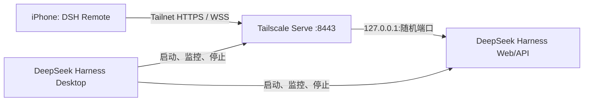

# DeepSeek Harness Desktop iOS Remote 方案

## 决策

首版采用“用户自带 Tailscale”的私有网络方案，不建设项目方云端中继：



项目方不接触代码、API Key、模型请求、Shell 输出或会话记录，也不承担长连接服务器成本。电脑仍是唯一执行主机；iPhone 只是控制面。

## 为什么 MVP 先使用 Harness Web UI

当前固定的 `@deepseek-ai/dsh@0.1.0-rc.6` 已经把浏览器控制面和协议实现完整。iOS 第一版用 SwiftUI 管理配对与连接，再用 `WKWebView` 加载官方 UI，可以立即覆盖会话、Prompt、流式输出、Queue/Steer/Cancel、审批和用户问题，而不复制 Agent runtime 或重新实现消息渲染。

这是验证 Remote 需求的最短闭环，不是最终 UI 承诺。确认真实使用后，再按相同 API 做原生“会话列表 + 对话 + 审批”界面。

## Desktop 端需要增加的 Remote Host

### 开启流程

1. Remote 默认关闭。用户在 Desktop 设置中主动点击“开启 Remote”。
2. Desktop 查找 `tailscale` CLI，并读取 `tailscale status --json`。
3. 只有 `BackendState=Running` 且存在本机 `DNSName` 时继续；否则显示安装或登录指引。
4. 选用专用端口 `8443`，构造公开给 Tailnet 的 authority：`<DNSName>:8443`。
5. 受监督地重启 Harness，并在既有参数后追加：

   ```text
   web --host 127.0.0.1 --port 0 --trusted-host <DNSName>:8443
   ```

6. Harness 输出 readiness URL 后，Desktop 启动并持有一个前台 Serve 子进程：

   ```text
   tailscale serve --yes --https=8443 http://127.0.0.1:<随机端口>
   ```

7. 校验 `tailscale serve status --json` 的 `8443` 目标确实等于本次 Harness 端口。
8. Desktop 显示连接地址与二维码：

   ```text
   dshremote://connect?url=https%3A%2F%2F<DNSName>%3A8443%2F
   ```

### 关闭与异常恢复

- 用户关闭 Remote：先停止 Serve 子进程，再以不带 `--trusted-host` 的默认参数重启 Harness。
- Desktop 正常退出：停止 Serve 子进程，再停止 Harness。
- Harness 重启或随机端口改变：停止旧 Serve，等待新 readiness，再将 Serve 指向新端口。
- Desktop 崩溃：前台 Serve 子进程应随父进程/Job Object/进程组退出；即使 Tailscale 状态短暂残留，旧目标也只是一个已关闭的 loopback 端口。
- 不调用 `tailscale serve reset`，因为它会删除用户机器上的其他 Serve 配置。
- 若 `8443` 已被用户占用，Remote 必须报告冲突，不应覆盖现有配置。首版不自动换端口，避免二维码和 `--trusted-host` 状态漂移。

macOS Tauri 和 Windows Electron 必须共用同一状态机与错误码；平台层只负责可执行文件发现、子进程监督和设置 UI 桥接。

## 安全模型

### 必须保持

- Harness 始终绑定 `127.0.0.1`，不能改为 `0.0.0.0`。
- 只能使用 Tailscale Serve，不能使用 Funnel。
- `--trusted-host` 只加入当前 Tailnet 的精确 DNS authority 和端口，不能加入通配符。
- 二维码只包含 URL，不包含 API Key、Tailscale key 或长期 bearer token。
- Remote 默认关闭，并提供明确的离线/撤销入口。

### 两层边界

`--trusted-host` 是 DSH 的 Host/Origin 防护，用来允许反向代理后的 HTTPS authority；它不是登录系统。用户身份与设备准入由 Tailscale Tailnet 和 ACL 决定。Tailscale Serve 会向后端添加身份头，但当前 Harness 不消费这些头，所以首版的授权粒度等于“Tailnet 中被允许访问该电脑 8443 端口的成员”。

个人 Tailnet 默认可能允许自己的设备互相访问；若 Tailnet 包含其他成员，应在文档中给出 ACL 示例，把 8443 只开放给用户自己的 iPhone 或用户组。

## iOS 客户端范围

当前工程位于 [`ios/DSHRemote`](../ios/DSHRemote)：

- SwiftUI：配对、电脑列表、错误与恢复；
- VisionKit：扫码；
- URLSession：连接前检查；
- WKWebView：加载 Harness Web UI 与其 HTTP RPC/WebSocket；
- Release 只接受 HTTPS `.ts.net`；
- 只允许 Harness 同源导航，外部链接交给系统浏览器。

暂不包含：推送通知、后台常驻连接、多用户共享、文件上传优化、原始终端、自动审批危险操作、App Store 订阅。

## 第二阶段：原生会话控制面

WebView MVP 证明连接和使用频率之后，再原生实现以下最小协议：

1. `session.list` 与 `session.history`；
2. `session.prompt`，支持 `queue` 和 `steer`；
3. `session.updateQueue` 与 `session.cancel`；
4. `/api/events.mux` 与 `/api/events.host` WebSocket 重连；
5. approval/question 的 `/api/respond`；
6. 只读工具视图与 diff。

每次升级 `@deepseek-ai/dsh` 都必须重新核对 `dsh-host-apiproxy` 类型。当前协议属于开发预览，不能把 rc.6 的线格式复制成长期稳定的 iOS 公共 API；更稳妥的做法是在 Desktop 中增加一个版本化的窄 Remote Adapter，由它把上游变化隔离在电脑端。

## MVP 验收门槛

以下场景全部通过后，才把 Remote 标为可用：

- 同一 Wi-Fi 下扫码并进入现有会话；
- iPhone 切换到蜂窝网络后仍可连接；
- Prompt → 流式事件 → Steer → Cancel 完整闭环；
- 手机上完成一次审批和一次用户问题回答；
- App 前后台切换、网络中断后重连，不重复发送 Prompt；
- 手机断开 Tailscale 后无法访问；
- Desktop 关闭 Remote 后，8443 立即不可访问；
- 错误的 Host/Origin 被 Harness 拒绝；
- Desktop 重启后二维码 authority 不变，Serve 目标更新到新的随机端口；
- macOS 与 Windows 各完成一次真机 iPhone 验收。

## 建议交付顺序

1. 先合入 iOS 客户端骨架和本方案；
2. 实现 macOS Tauri Remote Host，完成一台 Mac + 一台 iPhone 真机闭环；
3. 复用状态机实现 Windows Electron；
4. 收集 10 位真实用户的一周使用数据；只有反复使用手机 Steer/审批/查看结果，才投入原生消息 UI 和通知。
